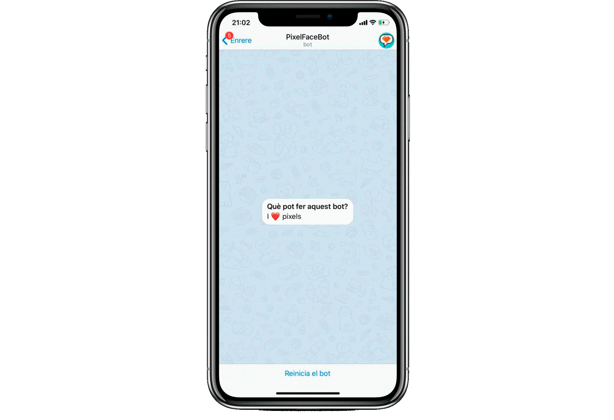
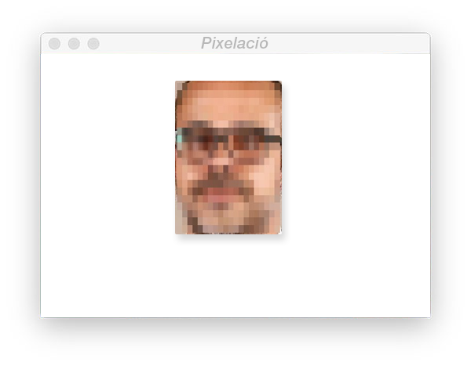
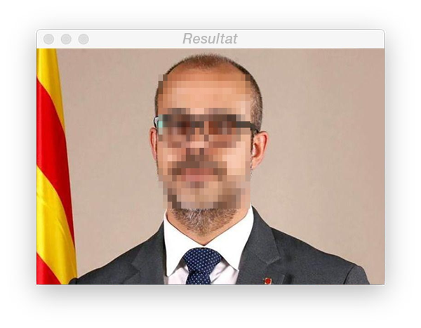

# PixelFaceBot
El PixelFaceBot és un robot de Telegram per a pixelar cares en qualsevol fotografia, respectant la privacitat de tots els usuaris. Envia una foto i el bot te la retornarà amb totes les cares censurades.



## Funcionament:
### Pas 1: Detecció facial

### Pas 2: Extracció de la cara (ROI)

### Pas 3: Censura (Pixelació)

### Pas 4: Resultat


## Requeriments:
```
pip install opencv-python
```
```
pip install python-telegram-bot --upgrade
```
